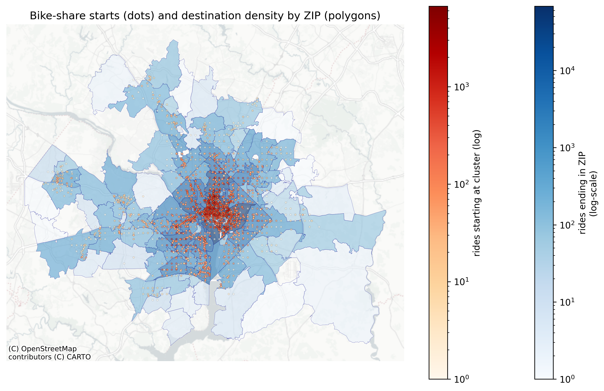

# 🚲 DC Capital Bikeshare Station Analysis


---
### 🚀 TL;DR
📍 Capital Bikeshare DC geospatial (GIS) project with spatial clustering and ZIP code overlays 

🧠 Identifies net sinks, sources, and rebalancing needs  

🗺️ Maps linked to employer zones and infrastructure planning  

📊 Stack: Python with GeoPandas, SQLite, and OSM geocoding  

📂 See `figures/` and `processed_data/` for key visual and data outputs  



---

## Project Goal

This project uses **GIS-based spatial analysis** to examine Capital Bikeshare trip data from the Washington D.C. metro area (April 2025), with the goal of:

* Detecting **imbalances** in bike flows between starting locations and end point ZIP codes
* Identifying **high-traffic hubs, net sinks, and underused stations**
* Mapping station activity against **major employer locations**
* Supporting **operational planning and infrastructure decisions** using geospatial insights

---
## Data Sources

This repository does **not** include large input data files (e.g., `input_data/trips.csv`) due to GitHub’s 100 MB file size limit. To run the full analysis, you will need to manually download and place the following file in the correct folder:

### 🔽 How to Obtain
You can download `input_data/trips.csv` (approximately 110 MB) from the **Capital Bikeshare System Data Portal**:

1. Visit: [https://www.capitalbikeshare.com/system-data](https://www.capitalbikeshare.com/system-data)
2. Find and download the trip data for the required time period (e.g., April 2025)
3. Save the downloaded file to `input_data/trips.csv`

**Note**: The filename must match exactly, or you may need to update file paths in the scripts inside the `code/` folder.

Other large files needed for this analysis can be obtained at the following links: 

- [ZIP code boundaries](https://www.census.gov/geo/reference/zip-codes.html)
- [Shapefile ZCTA520](https://www2.census.gov/geo/tiger/TIGER2024/ZCTA520/)
- [Biggest employers in DC in 2024](https://does.dc.gov/sites/default/files/dc/sites/does/publication/attachments/Top%20200%20Employers-20241%28FINAL%29.xlsx)

---

**Table 1**: datasets used in this project.

| Dataset                                 | Description | Used In | Location | Output |
|-----------------------------------------|-------------|---------|----------|--------|
| `april2025.db`                          | Raw trip data with timestamps, lat/lon, and station names | `join_matrix_station_names_from_db.py`, `zip_coded.py` | `input_data/` | Named clusters |
| `trips.csv`                             | Pre-extracted sample of trip data | `map_by_key_employers.py` | `input_data/` | Used for plotting |
| `tl_2024_us_zcta520.shp` (and siblings) | 2024 ZIP Code Tabulation Areas | `zip_coded.py` | `input_data/` | Filtered ZIP shapes |
| Employer list (in-code)                 | Top 200 employers in DC/VA/MD | `get_geocodes.py` | `code/` | Geocoded to CSV |
| `geocoded_employers.csv`                | Geocoded employer lat/lon points | `map_by_key_employers.py`, `zip_coded.py` | `processed_data/` | Overlay for maps |
| `cluster_matrix_tags.csv`               | Station-level metrics and classifications | `zip_coded.py` | `processed_data/` | Input to naming/joining |
| `named_cluster_matrix.csv`              | Clusters joined to station names | `join_matrix_station_names_from_db.py` | `processed_data/` | Final input for maps |


## Key Concepts
* **Station**: a named location from the original trip data e.g. "Union Station". Not all trips have station names recorded.
* **Cluster**: a unique coordinate pair for the starting position (start_lat, start_lng) rounded to 4 decimals (~11 m), approximately a dock/hub - used to analyse all data spatially.
* **ZIP code(ZCTA)**: area-level polygons - used to count how many trips end in each ZIP.

## Methodology

### 1. Preprocessing and Classification Logic (`zip_coded.py`) 

- Trips loaded from `.db`
- Convert start/end coordinates to spatial points
- Coordinates rounded to 4 decimals (≈11 meters) to define spatial clusters
- ZIP shapefile (`tl_2024_us_zcta520.shp`) filtered to match bounds of the data

- Count rides starting per cluster (`start_rides`)
- Count rides ending per ZIP (`dest_rides`)
- Classify:
  - `dot_class` = High, Medium, Low based on cluster volume (top 25%, bottom 25%)
  - `zip_class` = High, Medium, Low based on ZIP volume
- Combine into `matrix_cat`:

**Table 2**: classification buckets

| dot_class (starts) | zip_class (ends) | matrix_cat |
|--------------------|------------------|-------------|
| High               | High             | High-turnover hub |
| Low                | High             | Net sink ZIP |
| High               | Low              | Net source hub |
| Low                | Low              | Low traffic |
| —                  | —                | Balanced |

### 2. Station Naming (`join_matrix_station_names_from_db.py`)

- Extract start station names from `april2025.db`
- Join to clusters by rounded lat/lon
- Result: `named_cluster_matrix.csv`

### 3. Employer Selection and Mapping (`get_geocodes.py`)

To show how Bikeshare demand interacts with employement zones:
* Selected 4 representative employers, embedded in the code:
  * one each from employee size tier 9, 8, 1
  * one large employer outside the city centre
  * data Source: District of Columbia Department of Employment Services, https://does.dc.gov/sites/default/files/dc/sites/does/publication/attachments/Top%20200%20Employers-20241%28FINAL%29.xlsx
* Geocoded using OpenStreetMap Nominatim API
* Saved to `processed_data/geocoded_employers.csv`

### 4. Mapping & Visual Analysis

- `map_by_key_employers.py`: plots start clusters (as dots) and employer overlays
- `problem_stations_map.py`: filters and displays unbalanced locations e.g. net sinks
---

### Station Cluster Summary and Examples

#### Cluster Naming Breakdown

**Table 3**: Number of clusters by classification and by whether the station is named in the Capital Bikeshare raw data.

| Category | Named station | Unnamed station | unique starting  locations |
|---|---------------|-----------------|---|
| Balanced | 3003          | 434             | 3437 |
| High-turnover hub | 1013          | 212             | 1225 |
| Low traffic | 12            | 21              | 33 |
| Net sink ZIP | 1507          | 2               | 1509 |
| Net source hub | 1             | 1               | 2 |

### High-turnover Hubs (Examples)

- Busy stations like **Union Station**, **Eastern Market**, and **New Hampshire & T NW**
- Consistently high flows in and out

**Table 4**: Clusters with high-turnover hubs

| Start Station Name | Start Rides | ZIP |
|---|---|---|
| Columbus Circle / Union Station | 5001 | 20002 |
| New Hampshire Ave & T St NW | 3975 | 20009 |
| 5th & K St NW | 3763 | 20001 |
| Eastern Market Metro | 3658 | 20003 |
| 15th & P St NW | 3487 | 20005 |

### Net Sink ZIPs (Examples)

- Neighbourhoods where bikes pile up and don't leave
- Often around major government or office buildings

 **Table 5**: Clusters with net sink ZIPs

| Start Station Name | Start Rides | ZIP |
|---|---|---|
| Georgia Ave & Dahlia St NW | 1  | 20012 |
| Mt Vernon Trail & S. Washington St. | 1 | 22314 |
| Mt Vernon Trail & S. Washington St. | 1 | 22314 |
| 3rd St & Riggs Rd NE | 1 | 20011 |
| 3rd St & Riggs Rd NE | 1 | 20011 |

### Low traffic clusters

- Sparse stations with almost no recorded usage
- Potential candidates for removal or repurposing
- 
**Table 6**: Clusters with lowest traffic

| Start Station Name | Start Rides | ZIP |
|---|---|---|
| 20th & E St NW | 1  | 20245 |
| 10th St & Constitution Ave NW | 1  | 20530 |
| 15th & P St NW | 1  | 20220 |
| 21st St & Pennsylvania Ave NW | 1  | 20427 |
| 21st St & Pennsylvania Ave NW | 1 | 20427 |

### Balanced Stations (Examples)  

**Table 7**: Clusters with balanced traffic

| Start Station Name | Start Rides | ZIP |
|---|---|---|
| 37th & O St NW / Georgetown University | 2929 | 20057 |
| 15th St & Constitution Ave NW | 1683 | 20230 |
| Virginia Ave & 25th St NW | 1241 | 20566 |
| 9th St & Pennsylvania Ave NW | 1159 | 20535 |
| Arlington National Cemetery | 1074 | 22211 |

### Net Source Hubs

- Residential-heavy zones with outbound rides
- Suggests commuter demand with morning depletion

**Table 8**: Clusters with net source hubs

| start_station_name | start_rides | zip |
|---|---|---|
| Fishers Ln & Rock Creek Mill Rd | 41  | 20851 |


---


## Visualisations

### High-Traffic and Employer Proximity 


**Figure 1**: map of the bike hire stations in DC with overlays for three top employers.
---

### Cluster vs ZIP Matrix Map


**Figure 2**: Map of bike starting station clusters (as dots) and ZIP density of end destinations (as polygons)


## Key Insights and Recommendations

| Finding                                       | Recommendation                              |
|-----------------------------------------------|---------------------------------------------|
| Bikes accumulate in net sink ZIPs             | Add rebalancing routes, signage, incentives |
| Residential sources lose bikes in the morning | Prioritise morning bike delivery            |
| Many busy clusters unnamed                    | Improve trip metadata collection            |
| Employers cluster with stations               | Use employer data to plan expansion         |
| Low-use stations are idle                     | Consider removal or repurposing             |

---

## Project File Overview

| Script                      | Role                                | Inputs                     | Outputs                             |
|-----------------------------|-------------------------------------|----------------------------|-------------------------------------|
| `zip_coded.py`              | Core analysis + two-part map        | `.db`, `.shp`              | Classification CSV + matrix map png |
| `join_matrix_station_names_from_db.py` | Add names to clusters               | `.db`, cluster CSV         | Named matrix csv         |
| `get_geocodes.py`           | Geocode employer names              | Embedded list              | Geocoded csv                        |
| `map_by_key_employers.py`   | Plot clusters and employer overlays | `trips.csv`, employers csv | Employer hotspot png                |
| `problem_stations_map.py`   | Filters key imbalance clusters      | Named matrix               | Problem maps                        |

---

## Requirements

- Python 3.10+
- Core packages: `pandas`, `geopandas`, `matplotlib`, `shapely`, `contextily`, `sqlite3`
- Optional: `geopy` for geocoding and `tqdm` for progress bars

---

## How to Run

From the root directory:
```
# Step 1: Create clusters and classify by usage patterns
python code/zip_coded.py

# Step 2: Join station names to clustered coordinates
python code/join_matrix_station_names_from_db.py

# Step 3: Geocode employer locations (once)
python code/get_geocodes.py

# Step 4: Generate map with top employers
python code/map_by_key_employers.py

# Step 5: Generate map of problematic/unbalanced stations
python code/problem_stations_map.py
```
Ensure that data is in the correct folders:
```
project_root/
│
├── input_data/         # Raw inputs: .db, .csv, .shp
├── processed_data/     # Outputs: named clusters, geocoded employers
├── figures/            # Output maps (PNG)
└── code/               # All Python scripts
```


## Future Work

- Time-of-day analysis (AM-PM imbalance)
- Route flow analysis
- Streamlit app for interactive exploration
- Forecast rebalancing needs by hour

---

## Author

**Daniel Wilkinson.**  
[LinkedIn](https://www.linkedin.com/in/danielleewilkinson/) • [GitHub](https://github.com/daniel-lee-wilkinson)
